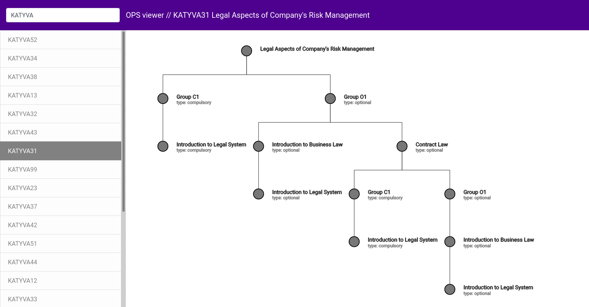

# OPS viewer

Visualize curriculums and prerequisite paths of Finnish universities. Supports
student information system Sisu's course unit format.



## Features

Implemented
- course search and visualization

Planned
- better graphing
- selecting curriculum years
- detailed course information
- links to official curriculum
- support for multiple universities

## Installation and running

```
npm install
npm start
```
